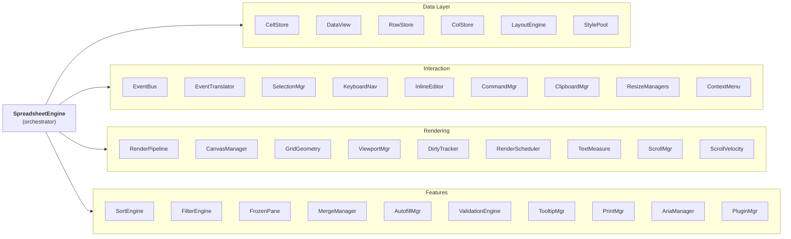

# Architecture

## Overview

@witqq/spreadsheet uses a single orchestrator pattern. The `SpreadsheetEngine` class creates, owns, and coordinates 20+ subsystems. Each subsystem is responsible for one concern and communicates with others through a typed `EventBus`.



## Zero-Dependency Core

The `@witqq/spreadsheet` package has no external dependencies. Everything — layout computation, text measurement, rendering, event handling, undo/redo — is implemented from scratch in TypeScript. This keeps the bundle small and avoids supply chain risk.

External dependencies are isolated in the `@witqq/spreadsheet-plugins` package (e.g., SheetJS for Excel I/O).

## Subsystem Breakdown

### Data Layer

- **CellStore** — Sparse `Map<string, CellData>` keyed by `"row:col"`. O(1) get/set. Only stores cells that have data.
- **DataView** — Logical-to-physical row mapping. Passthrough when no sort or filter is active. When sorting or filtering, maps visible row indices to actual data indices.
- **RowStore / ColStore** — `Float64Array` cumulative position arrays for O(1) cell rectangle computation.
- **LayoutEngine** — Computes cell rectangles using cumulative positions. O(1) by index, O(log n) binary search by pixel coordinate.
- **StylePool** — Deduplicates cell styles to reduce memory. Identical style objects share one reference.

### Interaction Layer

- **EventBus** — Typed publish/subscribe. All inter-subsystem communication goes through events.
- **EventTranslator** — Converts DOM mouse/touch/keyboard events into cell addresses via hit-testing. Identifies regions: cell, header, row-number, corner.
- **SelectionManager** — Tracks active cell, anchor cell, and selection ranges. Handles click, Shift+click, Ctrl+click, row select, column select, and select-all.
- **KeyboardNavigator** — Arrow keys, Tab, Enter, Home/End, PageUp/Down, Ctrl+Home/End, Shift+Arrow for range extension.
- **InlineEditor** — Textarea overlay positioned over the active cell. Opens on double-click or F2. Enter commits, Escape cancels. Scrolling the table commits the edit.
- **CommandManager** — Undo/redo stack with a 100-step limit. Commands: `CellEditCommand`, `BatchCellEditCommand`, column/row resize.
- **ClipboardManager** — Ctrl+C/X/V. Writes TSV and HTML table formats. Reads TSV for Excel/Google Sheets interop.
- **ColumnResizeManager / RowResizeManager** — Drag borders in headers or row numbers to resize. Undoable.
- **ContextMenuManager** — DOM overlay for right-click menus. Keyboard navigation. Extensible item registration.

### Rendering Layer

- **RenderPipeline** — Executes render layers in order. Each layer draws one visual concern on the canvas.
- **CanvasManager** — Creates and manages canvas elements. Handles DPI scaling and browser zoom detection.
- **GridGeometry** — Computes coordinates and caches layout data for the renderer.
- **ViewportManager** — Determines visible row/column range with a buffer zone for smooth scrolling.
- **DirtyTracker** — Tracks what needs re-rendering: full repaint, viewport change, or individual cell update.
- **RenderScheduler** — Coalesces render requests into a single `requestAnimationFrame` per frame.
- **TextMeasureCache** — LRU cache (10K entries) keyed by font+text. Uses binary search for text truncation with ellipsis.
- **ScrollManager** — Wraps the canvas in a scrollable div with native scrollbars.
- **ScrollVelocityTracker** — Detects fast scrolling (>150 px/frame for 2+ consecutive samples) and switches to placeholder rendering. Exits only after 150ms idle.

### Feature Layer

- **SortEngine** — Multi-column stable sort. Type-aware comparisons via CellTypeRegistry. Header click toggles asc/desc/none.
- **FilterEngine** — 14 operators (equals, contains, between, isEmpty, etc.) with AND logic. Integrates with DataView.
- **FrozenPaneManager** — 4-region viewport: corner, frozen-row, frozen-col, main content. ImageData caching for frozen regions.
- **MergeManager** — Spatial index for O(1) merge lookup. Tracks anchor cells and hidden cells. Uses physical row indices.
- **AutofillManager** — Fill handle drag. PatternDetector recognizes number sequences, dates, and repeating text. Merge-aware.
- **ValidationEngine** — Column-level and cell-level rules: required, min/max range, regex, custom functions.
- **TooltipManager** — Shows validation error tooltips on cell hover.
- **AriaManager** — WCAG 2.1 AA. `role=grid`, `aria-rowcount/colcount`, `aria-live` announcements.
- **PrintManager** — `@media print` CSS. Generates a DOM table from canvas data, respects DataView ordering.
- **PluginManager** — `Map<name, SpreadsheetPlugin>`. Install/remove/get plugins at runtime. Each plugin gets an isolated `PluginAPI`.

## Framework-Agnostic Design

The core engine knows nothing about React, Vue, Angular, or any framework. It operates on a plain `HTMLDivElement` container:

```ts
const container = document.getElementById('table');
const engine = new SpreadsheetEngine(config);
engine.mount(container);
```

The `@witqq/spreadsheet-react` package is a thin wrapper that manages the container div lifecycle, syncs React props to engine config, and forwards engine events to React callbacks.
