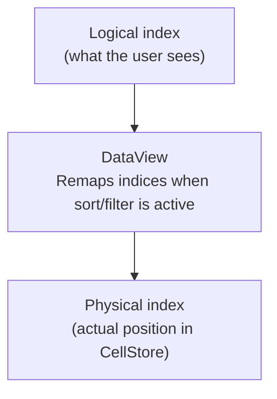

# Data Model

## CellStore

The `CellStore` is a sparse storage backed by a `Map<string, CellData>`. Keys are `"row:col"` strings (e.g., `"5:3"`). Only cells that contain data are stored — empty cells return `undefined`.

```ts
// O(1) get and set
const cell = cellStore.get(5, 3);    // CellData | undefined
cellStore.set(5, 3, { value: 42 });  // Stores cell at row 5, col 3
cellStore.delete(5, 3);              // Removes cell data
cellStore.has(5, 3);                 // Check if cell exists
cellStore.clear();                   // Clear all cells
```

### Metadata

```ts
cellStore.setMetadata(5, 3, { status: 'changed' });
cellStore.clearMetadata(5, 3);
```

### Bulk Operations

```ts
// Load a chunk of data from an array
cellStore.bulkLoadChunk(startRow, data, columnKeys);

// Generate rows with a factory function
cellStore.bulkGenerate(startRow, count, columnKeys, (index) => ({
  id: index + 1,
  name: `Row ${index + 1}`,
}));
```

### Properties

| Property | Type | Description |
|---|---|---|
| `size` | `number` | Number of cells stored |
| `version` | `number` | Mutation counter (increments on every write) |

This sparse representation is efficient for large datasets where most cells may be empty (e.g., 100K rows × 40 columns, but only populated cells use memory).

## CellData

Each stored cell is represented by a `CellData` object:

```ts
interface CellData {
  readonly value: CellValue;            // Raw value: string | number | boolean | Date | null
  readonly displayValue?: string;       // Formatted text shown in the cell
  readonly formula?: string;            // Formula string (e.g., "=SUM(A1:A10)")
  readonly style?: CellStyleRef;        // Reference to a shared style in the StylePool
  readonly type?: CellType;             // Overrides column-level type
  readonly metadata?: CellMetadata;     // Status indicators, links, comments
  readonly custom?: Record<string, unknown>;  // Extensible user-defined data
}
```

### CellValue Types

The `value` field stores one of:

| Type | Example | Notes |
|------|---------|-------|
| `string` | `"Hello"` | Plain text |
| `number` | `42`, `3.14` | Numeric values |
| `boolean` | `true`, `false` | Rendered as checkbox |
| `Date` | `new Date()` | JavaScript Date object |
| `null` | `null` | Empty cell |

The `displayValue` is the formatted string used for canvas rendering. For example, a number `1234.5` might have a `displayValue` of `"1,234.50"` depending on formatting. If `displayValue` is not set, `value` is converted to string for rendering.

## DataView

The `DataView` layer provides logical-to-physical row mapping. It sits between the rendering/interaction layer and the CellStore.



When no sort or filter is active, DataView is a passthrough — logical index equals physical index. When sorting or filtering, DataView maintains a mapping array that translates visible row indices to the actual data positions.

```ts
// Convert between logical and physical
const physicalRow = dataView.getPhysicalRow(logicalRow);
const logicalRow = dataView.getLogicalRow(physicalRow);

// Get the number of visible rows (may be less than total when filtered)
const visibleCount = dataView.visibleRowCount;

// Update total row count
dataView.setTotalRowCount(newCount);
```

## RowStore and ColStore

Row heights and column widths are stored as `Float64Array` cumulative position arrays. This enables two key operations:

- **O(1) cell rectangle lookup by index** — Position of row `n` is `cumulative[n]`, height is `cumulative[n+1] - cumulative[n]`.
- **O(log n) index lookup by pixel coordinate** — Binary search on the cumulative array to find which row/column a pixel position falls in.

```ts
// Cumulative positions example for 4 rows with height 30px each:
// [0, 30, 60, 90, 120]
//
// Row 2 starts at position 60, ends at 90, height = 30
```

## LayoutEngine

The `LayoutEngine` combines RowStore and ColStore to compute cell rectangles:

```ts
interface CellRect {
  readonly x: number;      // Left edge in pixels
  readonly y: number;      // Top edge in pixels
  readonly width: number;  // Cell width in pixels
  readonly height: number; // Cell height in pixels
}

// O(1) - direct array lookup
const rect = layoutEngine.getCellRect(row, col);

// O(log n) - binary search on cumulative array
const row = layoutEngine.getRowAtY(pixelY);
const col = layoutEngine.getColAtX(pixelX);
```

The `getRowAtY` and `getColAtX` methods are used by `EventTranslator` for hit-testing — converting mouse click coordinates into cell addresses.

## StylePool

The `StylePool` deduplicates cell styles using content-based hashing. When multiple cells share the same style (font, color, alignment, borders, etc.), they reference the same frozen style object in memory instead of each holding a copy.

```ts
const stylePool = new StylePool();

// Intern returns a ref key — identical styles produce the same key
const ref = stylePool.intern({
  fontWeight: 'bold',
  textColor: '#333',
  borderBottom: { width: 1, color: '#ccc', style: 'solid' },
});

// Resolve the ref to get the frozen CellStyle object
const style = stylePool.resolve(ref)!;

// Attach to cell data as a CellStyleRef
cellStore.set(0, 0, {
  value: 'Styled cell',
  style: { ref, style },
});
```

### API

| Method | Signature | Description |
|---|---|---|
| `intern` | `(style: CellStyle) => string` | Deduplicate and store a style, returns ref key |
| `resolve` | `(ref: string) => CellStyle \| undefined` | Look up a style by its ref key |
| `has` | `(ref: string) => boolean` | Check if a ref exists in the pool |
| `clear` | `() => void` | Remove all styles from the pool |
| `size` | `number` (getter) | Number of unique styles stored |

### CellStyleRef

The `CellData.style` field holds a `CellStyleRef` which carries both the dedup key and the resolved style:

```ts
interface CellStyleRef {
  readonly ref: string;       // StylePool dedup key
  readonly style: CellStyle;  // Resolved style object
}
```

The renderer reads `style.style` directly — it never calls `StylePool.resolve()` at render time.

See [Per-Cell Styling](/guides/styling/) for usage patterns including borders, alignment, and number formatting.
