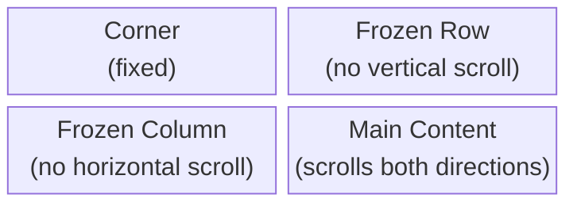

# Rendering

@witqq/spreadsheet renders everything on Canvas 2D instead of creating DOM nodes for each cell. This eliminates the DOM node ceiling and provides consistent 60 FPS performance regardless of dataset size.

## RenderPipeline

The rendering system uses a composable layer architecture. Each layer is responsible for one visual concern and draws onto the canvas in order:

| Order | Layer | Description |
|-------|-------|-------------|
| 1 | BackgroundLayer | Fills cell backgrounds with alternating row colors |
| 2 | GridLinesLayer | Draws horizontal and vertical grid lines |
| 3 | HeaderLayer | Renders column headers with sort/filter indicators |
| 4 | RowNumberLayer | Draws row numbers on the left side |
| 5 | CellTextLayer | Renders cell text content with type-specific formatting |
| 6 | SelectionOverlayLayer | Draws selection highlight and active cell border |
| 7 | CellStatusLayer | Shows cell status indicators (changed, saving, saved, error) |
| 8 | FillHandleLayer | Renders the fill handle square on the active cell |
| 9 | EmptyStateLayer | Shows empty state placeholder when no data |
| 10 | RowGroupToggleLayer | Renders expand/collapse toggles for row groups |

Plugin layers (added via plugins, not part of core):
- **ConditionalFormatLayer** — applies conditional formatting (gradients, data bars, icons)
- **RemoteCursorLayer** — renders remote user cursors in collaboration mode

Each layer implements the `RenderLayer` interface:

```ts
interface RenderLayer {
  name: string;
  render(ctx: RenderContext): void;
}

interface RenderContext {
  canvas: CanvasRenderingContext2D;
  viewport: ViewportRange;
  theme: SpreadsheetTheme;
  cellStore: CellStore;
  layoutEngine: LayoutEngine;
  selection: SelectionState;
}
```

## DirtyTracker

Not every frame requires a full repaint. The `DirtyTracker` identifies what changed and triggers the minimum necessary re-render:

| Dirty Type | Trigger | What Re-renders |
|------------|---------|-----------------|
| `full` | Theme change, resize, data reload | Entire canvas |
| `viewport-change` | Scroll, frozen pane toggle | Visible region only |
| `cell-update` | Cell edit, status change | Single cell clip region |

For `cell-update`, the renderer uses `ctx.save()`, `ctx.clip()` to restrict drawing to the affected cell rectangle, then runs only the relevant layers.

## RenderScheduler

Multiple operations in a single frame (e.g., a paste affecting 50 cells) would normally trigger 50 render calls. The `RenderScheduler` coalesces these into a single `requestAnimationFrame`:

```
Frame N:  setCell(0,0) → setCell(0,1) → setCell(0,2) → ...
          ↓               ↓               ↓
          markDirty()     markDirty()     markDirty()    (coalesced)
          ↓
Frame N+1: ONE render() call with all dirty regions merged
```

## ViewportManager

The `ViewportManager` calculates which rows and columns are currently visible, plus a buffer zone for smooth scrolling:

```ts
interface ViewportRange {
  startRow: number;    // First visible row
  endRow: number;      // Last visible row (inclusive)
  startCol: number;    // First visible column
  endCol: number;      // Last visible column (inclusive)
  bufferRows: number;  // Extra rows rendered above/below viewport
}
```

Only cells within the viewport (plus buffer) are rendered. For a 100K-row dataset, typically only 30-50 rows are drawn per frame.

## ScrollVelocityTracker

When the user scrolls fast, full cell rendering would cause frame drops. The `ScrollVelocityTracker` detects fast scrolling and switches to placeholder mode:

- **Entry condition**: 2 consecutive scroll samples exceeding 150 px/frame
- **Placeholder mode**: Renders simplified rectangles instead of full cell content
- **Exit condition**: Sticky — exits only after 150ms of scroll idle (no early exit on single slow frame)

This two-mode rendering ensures smooth scrolling even through large datasets.

## TextMeasureCache

Text measurement (`ctx.measureText()`) is expensive. The `TextMeasureCache` stores results in a `Map` keyed by `font+text`:

```ts
// Cache hit rate is typically >95% for real spreadsheets
const width = textMeasureCache.measure('14px Inter', 'Hello World');
```

- **Capacity**: 10,000 entries with LRU eviction
- **Text truncation**: Uses binary search to find the longest substring that fits in a cell width, then appends `"…"`

## Single-Canvas Architecture

@witqq/spreadsheet renders all layers on a single canvas element. The `CanvasManager` applies a comprehensive CSS reset (margin, padding, border, outline, box-sizing, etc.) to prevent any framework or parent CSS from displacing the canvas. It also handles DPR (Device Pixel Ratio) scaling and detects browser zoom changes via `matchMedia`, automatically recalibrating canvas resolution.

## Custom Render Layers

You can add custom layers to the pipeline or reorder existing ones:

```ts
engine.getRenderPipeline().addLayer(myCustomLayer);
engine.getRenderPipeline().insertLayerBefore('SelectionOverlayLayer', myCustomLayer);
engine.getRenderPipeline().removeLayer('EmptyStateLayer');
```

| Method | Description |
|---|---|
| `addLayer(layer)` | Append layer at end of pipeline |
| `insertLayerBefore(name, layer)` | Insert before a named layer |
| `removeLayer(name)` | Remove a layer by name |
| `getLayers()` | Get all layers in order |

## Frozen Pane Rendering

When frozen rows or columns are enabled, the `FrozenPaneManager` splits rendering into 4 regions:



Frozen regions are cached as `ImageData` and only re-rendered when their content changes, not on every scroll frame.
