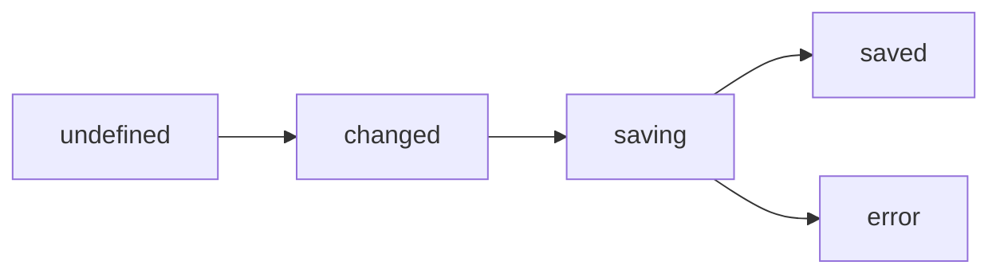

import { ChangeTrackingDemo } from '../../../components/demos/ChangeTrackingDemo';
import changeTrackingSource from '../../../components/demos/ChangeTrackingDemo.tsx?raw';
import { Code } from '@astrojs/starlight/components';

`ChangeTracker` monitors cell modifications and maintains a status lifecycle for each changed cell. This enables visual indicators (colored cell borders/backgrounds) that show users which cells have been modified, are being saved, or encountered errors.

## Status Lifecycle



- **undefined** — Cell has not been modified since baseline
- **changed** — Cell value differs from baseline
- **saving** — Save operation in progress
- **saved** — Successfully persisted (auto-clears after short delay)
- **error** — Save operation failed

<ChangeTrackingDemo client:visible />

<details>
<summary>View source code</summary>
<Code code={changeTrackingSource} lang="tsx" title="ChangeTrackingDemo.tsx" />
</details>

## Table with Change Tracking

```tsx
import { useRef } from 'react';
import { Spreadsheet, SpreadsheetRef } from '@witqq/spreadsheet-react';

function App() {
  const ref = useRef<SpreadsheetRef>(null);

  const handleSave = async () => {
    const tracker = ref.current?.getInstance().getChangeTracker();
    const changed = tracker?.getChangedCells() ?? [];

    for (const cell of changed) {
      tracker?.setCellStatus(cell.row, cell.col, 'saving');
    }

    try {
      await saveToBackend(changed);
      for (const cell of changed) {
        tracker?.setCellStatus(cell.row, cell.col, 'saved');
      }
    } catch (err) {
      for (const cell of changed) {
        tracker?.setCellStatus(cell.row, cell.col, 'error');
      }
    }
  };

  return (
    <>
      <button onClick={() => ref.current?.getInstance().getChangeTracker().captureBaseline()}>
        Capture Baseline
      </button>
      <button onClick={handleSave}>Save Changes</button>
      <Spreadsheet ref={ref} columns={columns} data={data} editable={true} />
    </>
  );
}
```

## Async Save Flow

Use `setCellStatus` to integrate with your backend save mechanism:

```tsx
// Mark cells as saving
tracker.setCellStatus(row, col, 'saving');

// On success
tracker.setCellStatus(row, col, 'saved');

// On failure
tracker.setCellStatus(row, col, 'error');
```

## API Reference

### ChangeTracker

| Method | Signature | Description |
|---|---|---|
| `captureBaseline` | `() => void` | Snapshot current state as baseline |
| `setCellStatus` | `(row: number, col: number, status: CellStatus) => void` | Set cell status |
| `getCellStatus` | `(row: number, col: number) => CellStatus \| undefined` | Get cell status |
| `getChangedCells` | `() => Array<{ row: number; col: number }>` | List all modified cells |
| `clearChanges` | `() => void` | Clear all tracking data |
