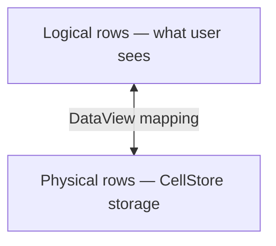
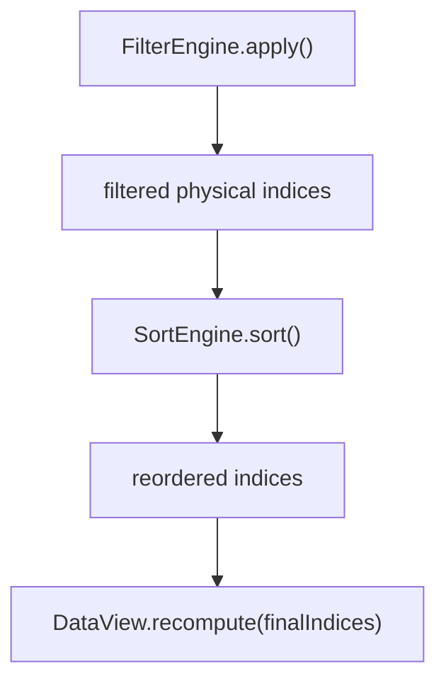

# DataView

`DataView` provides a mapping layer between logical (visible) row indices and physical (CellStore) row indices. When sorting or filtering is active, logical row 0 may map to physical row 500. When no sort/filter is active, DataView operates as a zero-overhead passthrough.

## Architecture



All engine subsystems (selection, editing, rendering) work with logical indices. `CellStore` operations use physical indices. `DataView` translates between the two.

## Setup

```typescript
import { DataView } from '@witqq/spreadsheet';

const view = new DataView({ totalRowCount: 10000 });
```

## DataViewConfig

```typescript
interface DataViewConfig {
  totalRowCount: number;
}
```

## API

### getPhysicalRow(logicalRow)

Convert a logical (visible) row index to its physical (CellStore) row index:

```typescript
const physRow = view.getPhysicalRow(0); // First visible row → actual storage row
```

Returns `-1` if the logical row has no mapping (out of range).

### getLogicalRow(physicalRow)

Convert a physical row index back to logical. Returns `undefined` if the row is hidden (filtered out):

```typescript
const logRow = view.getLogicalRow(500);
if (logRow === undefined) {
  console.log('Row 500 is filtered out');
}
```

### visibleRowCount

Number of visible rows after filtering:

```typescript
console.log(view.visibleRowCount); // e.g., 7500 (after filter)
```

### totalRowCount

Total physical rows (before filtering):

```typescript
console.log(view.totalRowCount); // e.g., 10000
```

### isPassthrough()

True when logical === physical (no sort/filter active). In passthrough mode, `getPhysicalRow` returns the input directly with zero overhead:

```typescript
if (view.isPassthrough()) {
  console.log('No sort/filter — direct mapping');
}
```

### recompute(physicalIndices)

Set a new mapping. `physicalIndices[logicalRow] = physicalRow`. Called by `SortEngine` and `FilterEngine` after sorting/filtering:

```typescript
// After sorting: logical row 0 = physical row 42, etc.
view.recompute([42, 15, 88, 3, 201, ...]);
console.log(view.visibleRowCount); // length of indices array
```

Also builds a reverse mapping (`Map<physical, logical>`) for `getLogicalRow()`.

### reset()

Reset to passthrough (identity mapping):

```typescript
view.reset();
console.log(view.isPassthrough()); // true
console.log(view.visibleRowCount === view.totalRowCount); // true
```

### setTotalRowCount(count)

Update total row count when rows are added or removed. In passthrough mode, this also updates `visibleRowCount`:

```typescript
view.setTotalRowCount(15000); // e.g., after pushRows
```

## Integration with Sort/Filter Pipeline

The sort/filter pipeline uses DataView as the output layer:



When both are cleared, `DataView.reset()` returns to passthrough mode.

## Integration with StreamingAdapter

`StreamingAdapter.updateRow()` and `StreamingAdapter.deleteRow()` use `DataView.getPhysicalRow()` internally. This ensures that operations on logical indices (what the user sees) correctly target the right physical rows, even when sort/filter is active.

## See Also

- [Sorting](/guides/sorting/) — multi-column sort via DataView
- [Filtering](/guides/filtering/) — 14 filter operators via DataView
- [Streaming Data](/guides/streaming/) — live row updates with DataView integration
