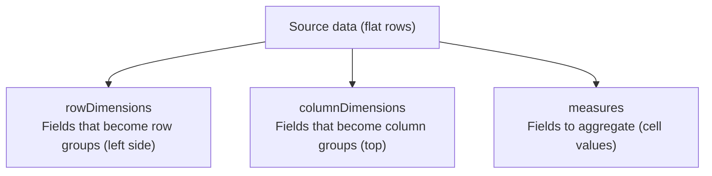

# Pivot Tables

The `PivotEngine` computes cross-tabulation results from flat source data. Define row dimensions, column dimensions, and measures with aggregate functions — the engine produces a pivot table with frozen dimension columns, computed values, and drill-down support.

## Concepts



## Setup

```typescript
import { PivotEngine } from '@witqq/spreadsheet';

const pivotEngine = new PivotEngine();

const result = pivotEngine.compute(sourceData, {
  rowDimensions: ['region', 'product'],
  columnDimensions: ['quarter'],
  measures: [
    { field: 'revenue', aggregate: 'sum', label: 'Revenue' },
    { field: 'orders', aggregate: 'count', label: 'Orders' },
  ],
});
```

## PivotConfig

```typescript
interface PivotConfig {
  rowDimensions: string[];
  columnDimensions: string[];
  measures: PivotMeasure[];
}
```

| Field | Type | Description |
|---|---|---|
| `rowDimensions` | `string[]` | Source fields for row grouping (left side of pivot) |
| `columnDimensions` | `string[]` | Source fields for column grouping (top of pivot). Empty array = no cross-tab. |
| `measures` | `PivotMeasure[]` | Value fields with aggregation (at least one required) |

## PivotMeasure

```typescript
interface PivotMeasure {
  field: string;
  aggregate: PivotAggregateFunction;
  label?: string;
}

type PivotAggregateFunction = 'sum' | 'count' | 'average' | 'min' | 'max';
```

| Aggregate | Description |
|---|---|
| `sum` | Sum of numeric values |
| `count` | Number of rows in group |
| `average` | Mean of numeric values |
| `min` | Minimum numeric value |
| `max` | Maximum numeric value |

Non-numeric values are ignored for `sum`, `average`, `min`, `max`. `count` counts all rows regardless of type.

## PivotResult

```typescript
interface PivotResult {
  columns: PivotColumnDef[];
  rows: Record<string, unknown>[];
  frozenColumns: number;
  sourceRowIndices: Map<string, number[]>;
}
```

| Field | Type | Description |
|---|---|---|
| `columns` | `PivotColumnDef[]` | Column definitions for the pivot output |
| `rows` | `Record<string, unknown>[]` | Flat rows of pivoted data |
| `frozenColumns` | `number` | Number of frozen columns (= `rowDimensions.length`) |
| `sourceRowIndices` | `Map` | Map `"outputRow:outputCol"` → source row indices for drill-down |

## PivotColumnDef

```typescript
interface PivotColumnDef {
  readonly key: string;
  readonly title: string;
  readonly width: number;
  readonly type?: CellType;
  readonly frozen?: boolean;
  readonly editable?: boolean;
}
```

Dimension columns are frozen and non-editable. Value columns have `type: 'number'` and are non-editable.

## Rendering Pivot Results

Pass `PivotResult` directly to the engine:

```typescript
const result = pivotEngine.compute(sourceData, config);

// Use pivot columns and rows directly
const engine = new SpreadsheetEngine({
  columns: result.columns,
  rowCount: result.rows.length,
  frozenColumns: result.frozenColumns,
});

// Populate cells from pivot rows
for (let r = 0; r < result.rows.length; r++) {
  const row = result.rows[r];
  for (let c = 0; c < result.columns.length; c++) {
    const value = row[result.columns[c].key];
    if (value !== undefined && value !== null) {
      engine.getCellStore().setValue(r, c, value);
    }
  }
}
```

## Drill-Down

Click on a pivot cell to see the source rows that contributed to the aggregate:

```typescript
const drillDownRows = pivotEngine.getDrillDownRows(
  sourceData,
  result,
  outputRow,  // clicked row in pivot output
  outputCol,  // clicked column in pivot output
);

console.log(`${drillDownRows.length} source rows contributed to this cell`);
```

## Example: Sales Data

```typescript
const salesData = [
  { region: 'North', product: 'Widget', quarter: 'Q1', revenue: 1200, orders: 15 },
  { region: 'North', product: 'Widget', quarter: 'Q2', revenue: 1500, orders: 20 },
  { region: 'South', product: 'Gadget', quarter: 'Q1', revenue: 800, orders: 10 },
  { region: 'South', product: 'Gadget', quarter: 'Q2', revenue: 950, orders: 12 },
  // ... more rows
];

const result = pivotEngine.compute(salesData, {
  rowDimensions: ['region', 'product'],
  columnDimensions: ['quarter'],
  measures: [
    { field: 'revenue', aggregate: 'sum', label: 'Total Revenue' },
    { field: 'orders', aggregate: 'count', label: 'Order Count' },
  ],
});

// Result:
// | Region | Product | Q1 — Total Revenue | Q1 — Order Count | Q2 — Total Revenue | Q2 — Order Count |
// |--------|---------|-------------------|------------------|-------------------|------------------|
// | North  | Widget  | 1200              | 1                | 1500              | 1                |
// | South  | Gadget  | 800               | 1                | 950               | 1                |
```

## See Also

- [Row Grouping](/guides/row-grouping/) — simpler parent-child grouping
- [Data Model](/concepts/data-model/) — CellStore and DataView
