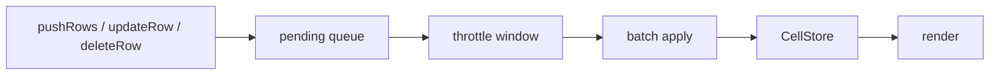

# Streaming Data

The `StreamingAdapter` enables live data updates to the engine without full re-initialization. Push new rows, update existing ones, or delete rows — changes are batched within a configurable throttle window before writing to `CellStore` and triggering a single render.

## Architecture



Multiple calls within the throttle window (default: 100ms) are coalesced into a single batch write, minimizing render cycles.

## Setup

```typescript
import { SpreadsheetEngine, StreamingAdapter } from '@witqq/spreadsheet';

const adapter = new StreamingAdapter(engine, {
  columnKeys: ['id', 'name', 'price', 'quantity'],
  throttleMs: 100, // default: 100ms
});
```

## StreamingAdapterOptions

```typescript
interface StreamingAdapterOptions {
  columnKeys: string[];
  throttleMs?: number;
}
```

| Option | Type | Default | Description |
|---|---|---|---|
| `columnKeys` | `string[]` | **required** | Column keys in order, matching engine column indices |
| `throttleMs` | `number` | `100` | Throttle window in ms for batching updates |

## API Methods

### pushRows(rows)

Append rows to the end of the grid:

```typescript
adapter.pushRows([
  { id: 101, name: 'New Item', price: 29.99, quantity: 5 },
  { id: 102, name: 'Another Item', price: 14.50, quantity: 12 },
]);
```

Rows are queued and applied after the throttle window. The engine's row count increases automatically.

### updateRow(index, data)

Update an existing row by logical index. Partial updates supported — only specified keys are modified:

```typescript
adapter.updateRow(5, { price: 39.99, quantity: 0 });
```

The logical index is translated to a physical row via `DataView`, so updates work correctly even when sort/filter is active.

### deleteRow(index)

Delete a row by logical index:

```typescript
adapter.deleteRow(10);
```

Deletion shifts all subsequent rows up in `CellStore` and updates `RowStore` height overrides. The engine row count decreases automatically.

### flush()

Immediately apply all pending updates, bypassing the throttle timer:

```typescript
adapter.flush();
```

### dispose()

Flush pending updates and prevent further scheduling:

```typescript
adapter.dispose();
console.log(adapter.disposed); // true
```

## Batch Events

After applying a batch, the adapter emits a `cellChange` event with `source: 'streaming-adapter'` and sentinel values (`row: -1`, `col: -1`). Use this to detect batch completions:

```typescript
engine.getEventBus().on('cellChange', (event) => {
  if (event.source === 'streaming-adapter') {
    console.log('Streaming batch applied');
  }
});
```

## Integration with Sort/Filter

`updateRow` and `deleteRow` use `DataView.getPhysicalRow()` internally, so they work correctly when sort or filter is active. The logical index you pass corresponds to the visible (sorted/filtered) order.

After a streaming batch, sort/filter state is preserved — the engine re-renders with updated data in the current sort/filter order. To re-sort after updates, trigger sort manually via `SortEngine`.

## Real-Time Data Example

```typescript
const ws = new WebSocket('wss://data-feed.example.com');

ws.onmessage = (event) => {
  const msg = JSON.parse(event.data);

  switch (msg.type) {
    case 'insert':
      adapter.pushRows(msg.rows);
      break;
    case 'update':
      adapter.updateRow(msg.rowIndex, msg.data);
      break;
    case 'delete':
      adapter.deleteRow(msg.rowIndex);
      break;
  }
};

// Clean up on disconnect
ws.onclose = () => adapter.dispose();
```

## See Also

- [Event System](/concepts/events/) — `cellChange` events from streaming updates
- [DataView](/guides/dataview/) — logical↔physical row mapping used by streaming
- [Change Tracking](/guides/change-tracking/) — cell status lifecycle for server sync
