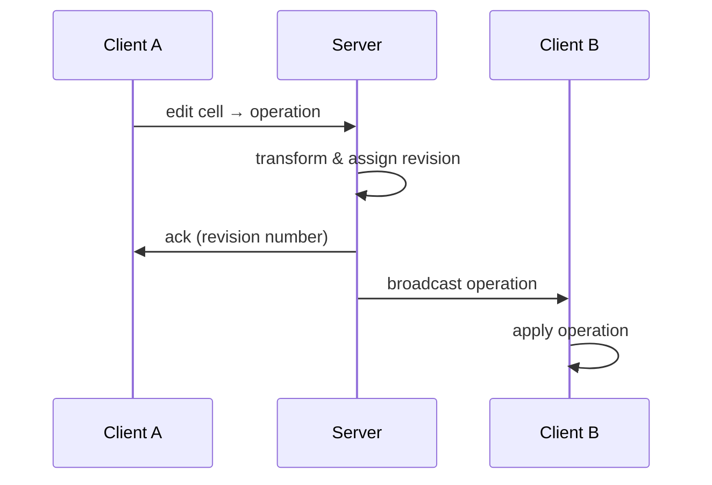

# Collaboration Plugin

The `CollaborationPlugin` enables real-time multi-user editing using Operational Transformation (OT). Local cell edits are captured, transformed against concurrent remote operations, and broadcast to all connected clients. A companion WebSocket relay server handles operation ordering and cursor relay.

## Architecture



Each client maintains a local pending queue. The server assigns revision numbers and transforms operations against its history. Clients transform incoming remote operations against their pending queue before applying.

## Installation

```bash
npm install @witqq/spreadsheet @witqq/spreadsheet-plugins
```

## Plugin Setup

```typescript
import { CollaborationPlugin, WebSocketTransport, RemoteCursorLayer } from '@witqq/spreadsheet-plugins';

const cursorLayer = new RemoteCursorLayer();
const transport = new WebSocketTransport({
  url: 'ws://localhost:3151',
  onInit: ({ clientId, color, revision, cursors }) => {
    console.log(`Connected as ${clientId} (${color}) at revision ${revision}`);
    // Initialize existing cursors
    for (const c of cursors) {
      if (c.cursor) cursorLayer.setCursor(c.clientId, { ...c, row: c.cursor.row, col: c.cursor.col });
    }
  },
  onCursor: (info) => {
    if (info.cursor) {
      cursorLayer.setCursor(info.clientId, { ...info, row: info.cursor.row, col: info.cursor.col });
    } else {
      cursorLayer.removeCursor(info.clientId);
    }
    engine.requestRender();
  },
  onLeave: ({ clientId }) => {
    cursorLayer.removeCursor(clientId);
    engine.requestRender();
  },
});

await transport.connect();

const collab = new CollaborationPlugin({
  clientId: 'unique-client-id',
  transport,
  cursorLayer,
  sendCursor: (cursor) => transport.sendCursor(cursor),
});

engine.installPlugin(collab);
```

## CollaborationPluginConfig

```typescript
interface CollaborationPluginConfig {
  clientId: string;
  transport: OTTransport;
  cursorLayer?: RemoteCursorLayer;
  sendCursor?: (cursor: { row: number; col: number } | null) => void;
}
```

| Option | Type | Description |
|---|---|---|
| `clientId` | `string` | Unique client identifier |
| `transport` | `OTTransport` | Transport implementation (WebSocket or mock) |
| `cursorLayer` | `RemoteCursorLayer` | Optional render layer for remote cursor display |
| `sendCursor` | `function` | Callback to send cursor position updates |

## OT Operation Types

Three operation types cover all spreadsheet collaboration scenarios:

```typescript
type OTOperation = SetCellValueOp | InsertRowOp | DeleteRowOp;

interface SetCellValueOp {
  type: 'setCellValue';
  row: number;
  col: number;
  value: unknown;
  oldValue?: unknown;
}

interface InsertRowOp {
  type: 'insertRow';
  row: number;
  count: number;
}

interface DeleteRowOp {
  type: 'deleteRow';
  row: number;
  count: number;
}
```

Operations are wrapped in `VersionedOperation` for transport:

```typescript
interface VersionedOperation {
  clientId: string;
  revision: number;
  op: OTOperation;
}
```

## Transform Functions

The OT engine handles all 9 operation pairs (3×3 matrix):

```typescript
import { otTransform, transformAgainstAll } from '@witqq/spreadsheet-plugins';

// Transform opA against opB → [opA', opB'] (either may be null for no-op)
const [aPrime, bPrime] = otTransform(opA, opB);

// Transform local op against a list of server ops
const transformed = transformAgainstAll(localOp, serverOps);
```

**Transform rules:**

| opA × opB | Behavior |
|---|---|
| `setCellValue × setCellValue` | Same cell → last-writer-wins (opB wins); different cells → no conflict |
| `setCellValue × insertRow` | Cell row ≥ insert row → shift down by insert count |
| `setCellValue × deleteRow` | Cell in deleted range → no-op; cell below → shift up |
| `insertRow × insertRow` | Earlier insert shifts later insert down |
| `insertRow × deleteRow` | Adjusts positions based on relative ranges |
| `deleteRow × deleteRow` | Overlapping ranges → compute remaining deletions |

**Invariant:** `apply(apply(state, opA), opB')` === `apply(apply(state, opB), opA')`

## OTTransport Interface

```typescript
interface OTTransport {
  send(op: VersionedOperation): void;
  onReceive(handler: (op: VersionedOperation) => void): void;
  onAck(handler: (revision: number) => void): void;
  disconnect(): void;
}
```

### WebSocketTransport

Connects to the collaboration relay server:

```typescript
interface WebSocketTransportConfig {
  url: string;
  onInit?: (data: { clientId: string; color: string; revision: number; cursors: CursorInfo[] }) => void;
  onCursor?: (info: CursorInfo) => void;
  onJoin?: (info: { clientId: string; color: string; name: string }) => void;
  onLeave?: (info: { clientId: string }) => void;
}
```

| Method | Description |
|---|---|
| `connect()` | Establish WebSocket connection (async) |
| `send(op)` | Send operation to server |
| `sendCursor(cursor)` | Send cursor position update |
| `disconnect()` | Close connection and clean up |
| `getClientId()` | Get assigned client ID |

### MockTransport

For testing — connects two clients directly without a server:

```typescript
const [transportA, transportB] = MockTransport.createPair();

// Operations sent by A are received by B (and vice versa)
// Each transport auto-acks with incrementing revision numbers
```

## RemoteCursorLayer

Canvas render layer that displays colored cell overlays for remote users:

```typescript
const cursorLayer = new RemoteCursorLayer();

// Set or update a remote cursor
cursorLayer.setCursor('client-2', {
  clientId: 'client-2',
  color: '#3498db',
  name: 'Bob',
  row: 5,
  col: 3,
});

// Remove when user leaves
cursorLayer.removeCursor('client-2');

// Get all active cursors
const cursors: RemoteCursor[] = cursorLayer.getCursors();
```

Each cursor renders as:
- Semi-transparent colored fill over the cell (20% opacity)
- 2px solid colored border
- Name label above the cell with colored background

## Plugin API

| Method | Description |
|---|---|
| `getPendingCount()` | Number of unacknowledged local operations |
| `getRevision()` | Current server revision number |

---

## Collaboration Server

The relay server (`packages/server/`) manages operation ordering, transformation, cursor relay, and session lifecycle.

### Starting the Server

```typescript
import { createCollabServer } from '@witqq/spreadsheet-server';

const { wss, close } = createCollabServer(3151);
// Server listens on ws://localhost:3151
```

Or via Docker:

```bash
npm run dev  # Starts both app (3150) and collab server (3151)
```

### createCollabServer(port)

Returns `{ wss: WebSocketServer, close: () => void }`.

The server:
1. Assigns each connecting client a unique ID and color (rotating through 8 colors)
2. Sends `init` message with client info, current revision, and active cursors
3. Broadcasts `join`/`leave` events to other clients

### Server-Side OT Transform

When the server receives an operation:

1. Transforms it against all operations since the client's revision
2. Assigns a new revision number
3. Stores in history
4. Sends `ack` to the sender with the new revision
5. Broadcasts the transformed operation to all other clients

If transformation results in a no-op, the server still sends an `ack`.

### Cursor Relay

Cursor updates are relayed to all other clients without transformation. Each cursor message includes `clientId`, `color`, `name`, and `cursor` position.

### Auto-Reset

When the last client disconnects, the server resets its state:
- Clears operation history
- Resets revision counter (first client receives revision `0`)

This ensures a clean state for the next session.

### Message Types

| Type | Direction | Fields |
|---|---|---|
| `init` | Server → Client | `clientId`, `color`, `revision`, `cursors` |
| `op` | Both directions | `clientId`, `revision`, `op` |
| `ack` | Server → Client | `revision` |
| `cursor` | Both directions | `clientId`, `color`, `name`, `cursor` |
| `join` | Server → Client | `clientId`, `color`, `name` |
| `leave` | Server → Client | `clientId` |

## See Also

- [Streaming Data](/guides/streaming/) — live data updates without collaboration
- [Event System](/concepts/events/) — events emitted during collaborative edits

## API Types

### Operation

Union type covering all three OT operation kinds used for collaboration.

```ts
type OTOperation = SetCellValueOp | InsertRowOp | DeleteRowOp;

interface SetCellValueOp {
  type: 'setCellValue';
  row: number;
  col: number;
  value: unknown;
  oldValue?: unknown;
}

interface InsertRowOp {
  type: 'insertRow';
  row: number;
  count: number;
}

interface DeleteRowOp {
  type: 'deleteRow';
  row: number;
  count: number;
}
```

### ClientState

State assigned to each client on connection, including cursor position metadata.

```ts
interface CursorInfo {
  clientId: string;
  color: string;
  name: string;
  cursor: { row: number; col: number } | null;
}
```

The server sends full client state on `init`:

```ts
interface InitData {
  clientId: string;
  color: string;
  revision: number;
  cursors: CursorInfo[];
}
```

### RemoteCursorLayer

Canvas render layer that draws colored cell overlays and name labels for remote users.

```ts
class RemoteCursorLayer implements RenderLayer {
  setCursor(clientId: string, cursor: RemoteCursor | null): void;
  removeCursor(clientId: string): void;
  getCursors(): RemoteCursor[];
  render(rc: RenderContext): void;
}

interface RemoteCursor {
  clientId: string;
  color: string;
  name: string;
  row: number;
  col: number;
}
```

### WebSocketTransport

OTTransport implementation that connects to the collaboration relay server via WebSocket.

```ts
class WebSocketTransport implements OTTransport {
  constructor(config: WebSocketTransportConfig);
  connect(): Promise<void>;
  send(op: VersionedOperation): void;
  sendCursor(cursor: { row: number; col: number } | null): void;
  disconnect(): void;
  getClientId(): string;
}

interface WebSocketTransportConfig {
  url: string;
  onInit?: (data: InitData) => void;
  onCursor?: (info: CursorInfo) => void;
  onJoin?: (info: { clientId: string; color: string; name: string }) => void;
  onLeave?: (info: { clientId: string }) => void;
}
```
