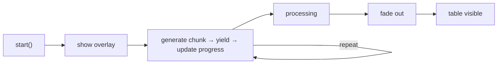

# Progressive Loader Plugin

The `ProgressiveLoaderPlugin` loads large datasets (100K–1M+ rows) without blocking the main thread. Rows are generated in time-budgeted chunks with browser yielding between iterations. A DOM progress overlay displays loading status with animated progress bar and percentage.

## How It Works



Each iteration works for up to `chunkBudgetMs` (default: 50ms), then yields to the browser. This keeps CSS animations smooth and the page responsive to user input.

### Yielding Strategy

The plugin uses two yield mechanisms, chosen automatically:

| Method | When | Benefit |
|---|---|---|
| `scheduler.yield()` | Chrome 129+ | Cooperates with browser event prioritization, best INP scores |
| `MessageChannel` | All browsers | Near-zero overhead, no 4ms clamping (unlike `setTimeout(0)`) |

Reference: [web.dev/optimize-long-tasks](https://web.dev/articles/optimize-long-tasks)

## Installation

```bash
npm install @witqq/spreadsheet @witqq/spreadsheet-plugins
```

## Basic Usage

```typescript
import { ProgressiveLoaderPlugin } from '@witqq/spreadsheet-plugins';

const loader = new ProgressiveLoaderPlugin({
  totalRows: 1_000_000,
  columnKeys: ['id', 'name', 'email', 'amount', 'date', 'status'],
  generateRow: (index) => ({
    id: index + 1,
    name: `User ${index + 1}`,
    email: `user${index + 1}@example.com`,
    amount: Math.round(Math.random() * 10000) / 100,
    date: new Date(2020, 0, 1 + (index % 1000)).toISOString().slice(0, 10),
    status: index % 3 === 0 ? 'active' : 'inactive',
  }),
  onProgress: (loaded, total) => {
    console.log(`${loaded}/${total} rows loaded`);
  },
  onComplete: (loadTimeMs) => {
    console.log(`Loading complete in ${loadTimeMs}ms`);
  },
});

engine.installPlugin(loader);
loader.start();
```

## ProgressiveLoaderConfig

```typescript
interface ProgressiveLoaderConfig {
  totalRows: number;
  columnKeys: string[];
  generateRow: (index: number) => Record<string, unknown>;
  onProgress?: (loaded: number, total: number) => void;
  onComplete?: (loadTimeMs: number) => void;
  chunkBudgetMs?: number;
}
```

| Option | Type | Default | Description |
|---|---|---|---|
| `totalRows` | `number` | **required** | Total number of rows to generate |
| `columnKeys` | `string[]` | **required** | Column keys matching engine column order |
| `generateRow` | `function` | **required** | Row generator: `(index) → { col: value }` |
| `onProgress` | `function` | — | Called after each chunk with loaded/total counts |
| `onComplete` | `function` | — | Called when all rows loaded, receives elapsed time in ms |
| `chunkBudgetMs` | `number` | `50` | Maximum ms to spend per chunk before yielding |

## Progress Overlay

The plugin mounts a DOM overlay over the table container with three phases:

### Loading Phase
- Large percentage text (`0%` → `100%`) with tabular-nums font
- Animated progress bar with shimmer effect
- Row count detail: `250,000 / 1,000,000 rows`

### Processing Phase
- Text changes to `Processing…`
- Progress bar switches to indeterminate animation
- Shimmer hidden

### Done Phase
- Overlay fades out via CSS transition (500ms opacity)
- Removed from DOM after fade completes (600ms)
- Table becomes visible and interactive

The overlay supports both dark and light themes via `data-theme="light"` on the root element. Dark theme is default.

## API Methods

| Method | Return | Description |
|---|---|---|
| `start()` | `void` | Begin progressive loading (no-op if already loading) |
| `cancel()` | `void` | Cancel ongoing loading, immediately remove overlay |
| `getProgress()` | `number` | Fraction loaded: `0` → `1` |
| `isLoading()` | `boolean` | Whether loading is in progress |
| `getLoadedRows()` | `number` | Number of rows loaded so far |

## Internal Loading Loop

```
const BATCH_SIZE = 5000; // hardcoded

while (loadedRows < totalRows) {
  if (cancelled) return;
  deadline = performance.now() + chunkBudgetMs;

  while (loadedRows < totalRows && performance.now() < deadline) {
    store.bulkGenerate(loadedRows, BATCH_SIZE, columnKeys, generateRow);
    loadedRows += BATCH_SIZE;
  }

  engine.setRowCount(loadedRows);
  engine.requestRender();
  overlay.setProgress(loadedRows, totalRows);
  onProgress?.(loadedRows, totalRows);

  await yieldToMain();  // scheduler.yield() or MessageChannel
}
```

Each chunk uses `bulkGenerate` with a fixed batch size of 5,000 rows for efficient CellStore writes. The engine re-renders and updates the overlay between chunks.

## Performance

Typical loading times for 1,000,000 rows (6 columns):
- Modern desktop: ~3–5 seconds
- The page remains responsive throughout (scrolling, clicking, CSS animations)
- Progress overlay animations run on the compositor thread, unaffected by JS execution
